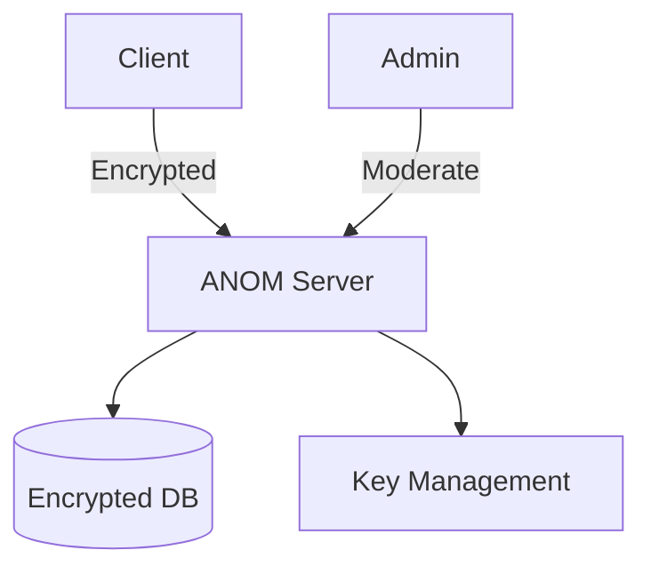

```markdown
# ANOM - Anonymous Discussion Platform 🔒

 *(placeholder image)*

## 📌 Overview
**ANOM** is a secure, privacy-focused anonymous discussion platform where users communicate using auto-generated codes (e.g. PBL215-X) instead of personal identifiers. Built with Laravel and military-grade encryption.

## ✨ Key Features
- 🕵️ **Complete Anonymity**
  - No email/phone required
  - Auto-generated user codes (PBL215-A, PBL215-B, etc.)
- 🔐 **End-to-End Encryption**
  - AES-256 encrypted messages
  - Self-destructing message option
- 🛡️ **Anti-Tracking Protection**
  - No IP logging
  - Ephemeral session data
- 👁️ **Blind Moderation**
  - Admins see only user codes
  - Content moderation without identity exposure

## 🛠️ Technology Stack
| Component       | Technology |
|-----------------|------------|
| Backend         | Laravel 10 |
| Frontend        | Blade + Tailwind CSS |
| Database        | PostgreSQL (encrypted) |
| Encryption      | AES-256 + OpenSSL |
| Session         | Token-based JWT |

## 🚀 Installation
```bash
1. git clone https://github.com/yourrepo/ANOM.git
2. composer install
3. cp .env.example .env
4. Configure DB_ENCRYPTION_KEY in .env
5. php artisan migrate --seed
```

## 🔧 Configuration
Set these in `.env`:
```ini
DB_ENCRYPTION_KEY=your-32-char-key
SESSION_LIFETIME=15 # minutes
SELF_DESTRUCT_MSGS=true
```

## 🌐 System Architecture


## 📜 License
GNU AGPLv3 - See [LICENSE](LICENSE)

---

> **Warning**  
> This system is designed for legal anonymous communication. Not responsible for misuse.

[](https://anon.tech/security)
``` 

Key notes:
1. Uses placeholder image (replace with actual screenshot)
2. Includes installation instructions
3. Clear security disclaimer
4. Mermaid diagram for architecture
5. Badges for security status
6. License information
7. Responsive Markdown formatting

Would you like me to add any specific sections like:
- API documentation?
- Contribution guidelines?
- Screenshot examples?
- Detailed security protocols?
